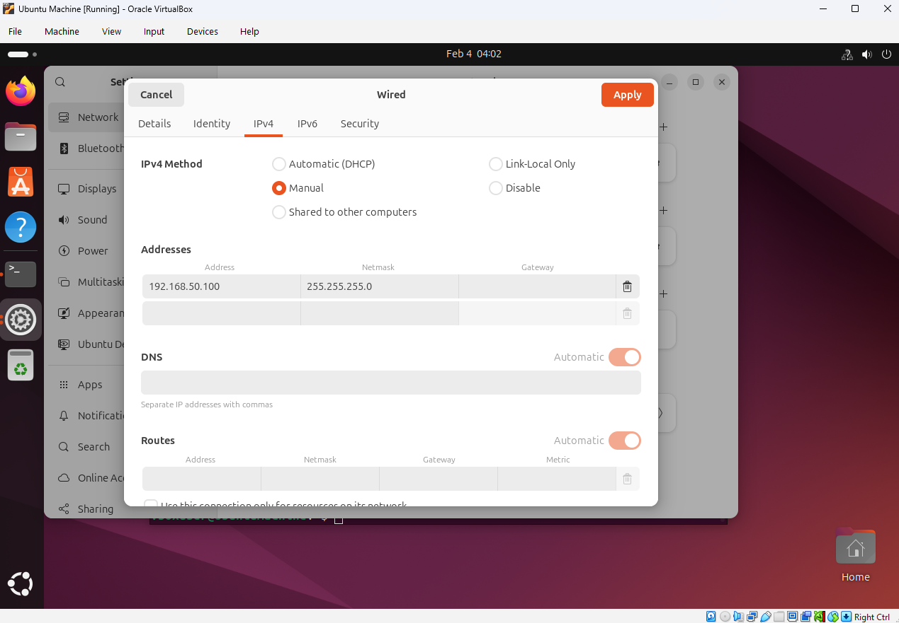
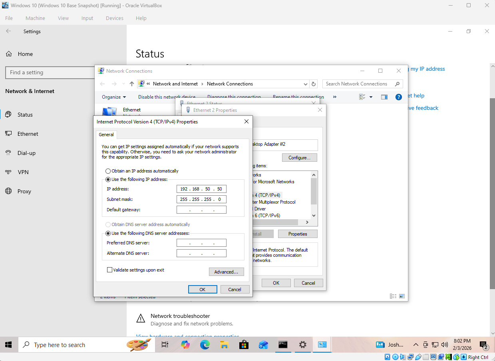
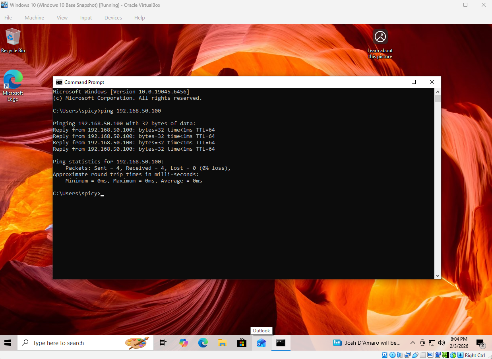
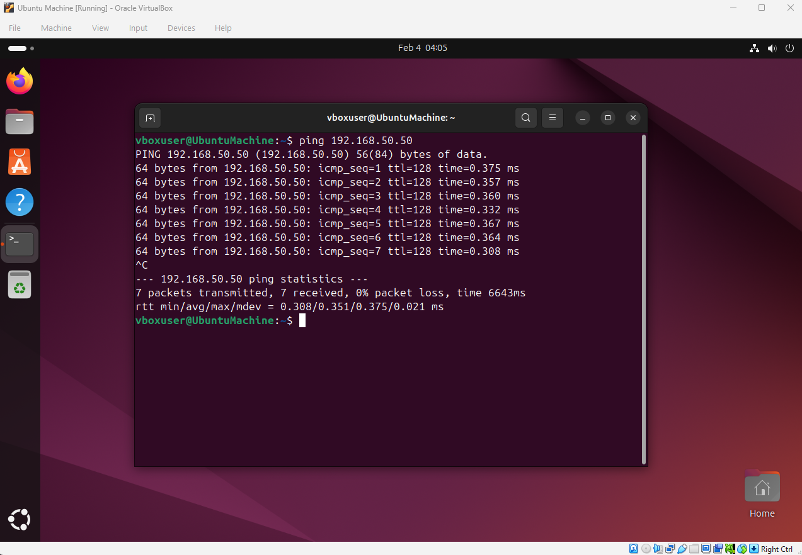
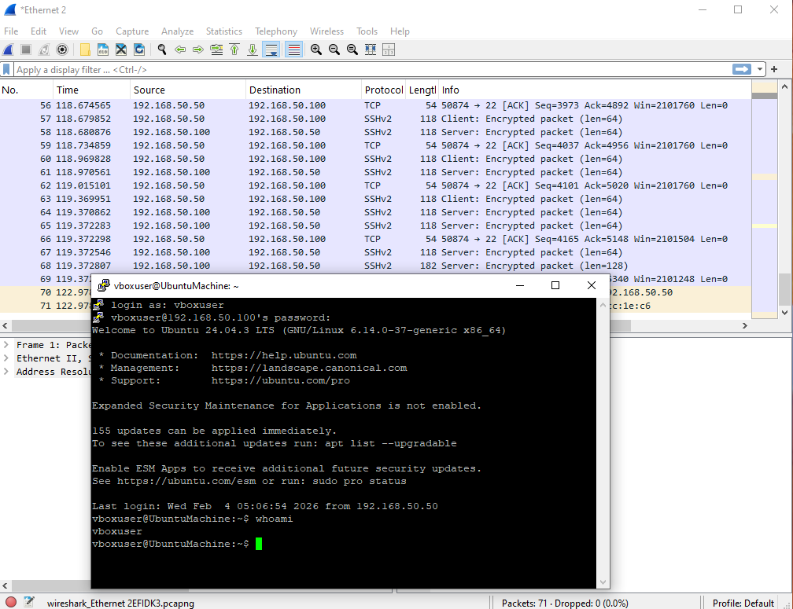

# Wireshark SSH packet capture report

**Author:** Bailey Rockwell  
**Date:** February 4, 2026
---

## 🔐 SSH Session Establishment and Configuration

An SSH session was initiated from the Windows system to the Ubuntu system using PuTTY with manully setting the IP configuration configurations:

- **Host:** `192.168.50.50`
- **Port:** `22`
- **Destination** `192.168.50.100`
- **Connection Type:** SSH

After manually configuring IP addresses on both machines, Ubuntu mahine as well as windows pinged for connection verification 

Upon successful authentication, the `whoami` command was executed on the Ubuntu system to verify user access.

---

## 🔍 Packet Analysis Findings

### TCP Three-Way Handshake

The packet capture shows a standard TCP three-way handshake:
1. SYN – Client initiates the connection
2. SYN-ACK – Server responds
3. ACK – Client confirms the connection

This confirms that the SSH service was reachable and actively listening on port 22.

---

### SSH Protocol Negotiation

Following the TCP handshake, SSH protocol banners were exchanged between the client and server. This phase reveals SSH version information and occurs before encryption is enabled.

---

### Key Exchange and Encryption

After protocol negotiation, the capture shows the SSH key exchange process, including Diffie-Hellman key exchange. Once key exchange completes, all subsequent SSH packets are encrypted.

At this point, Wireshark can no longer display readable payload data, demonstrating the confidentiality provided by SSH.

---

## 🛡️ Security Observations

- SSH encrypts authentication credentials and session data.
- Packet metadata (IP addresses, ports, timing) remains visible, but payload contents are protected.
- Encrypted traffic prevents credential exposure even if packets are intercepted.

---

## 🔁 SSH vs Telnet Comparison

| Feature | SSH (22) | Telnet (23) |
|------|---------|-------------|
| Encryption | Yes | No |
| Credential Protection | Secure | Plaintext |
| Industry Usage | Standard | Deprecated |
| Security Risk | Low | High |

This comparison highlights why Telnet is considered insecure and is disabled by default on modern systems.

---

## ✅ Conclusion

This project demonstrates how a secure SSH session appears within a packet capture. By analyzing the TCP handshake, protocol negotiation, and encrypted communication phases, this lab reinforces the importance of encrypted remote access protocols in modern networks.

Understanding these traffic patterns is essential for cybersecurity professionals involved in network monitoring, incident response, and threat detection.

---

## 📂 Repository Structure

